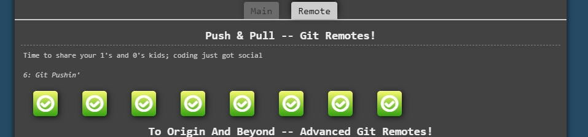
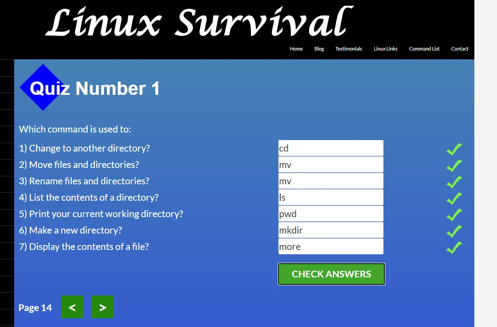
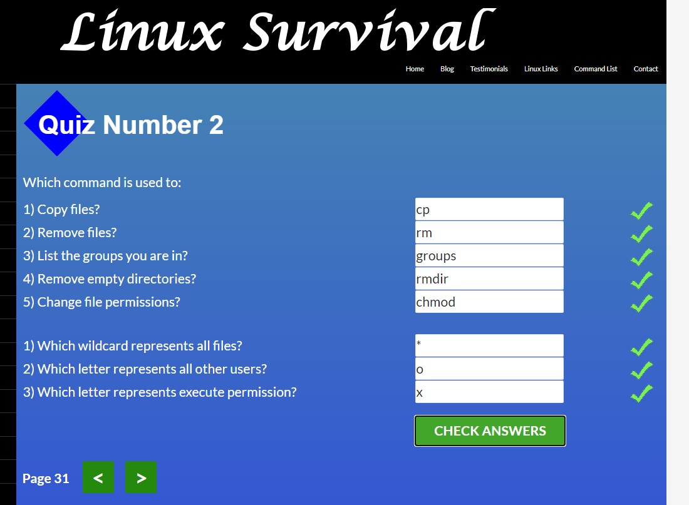
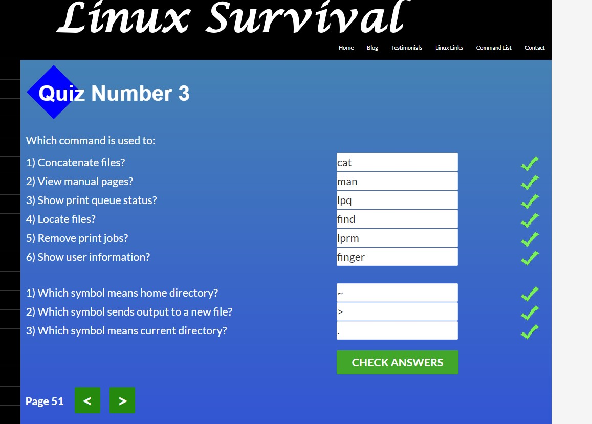
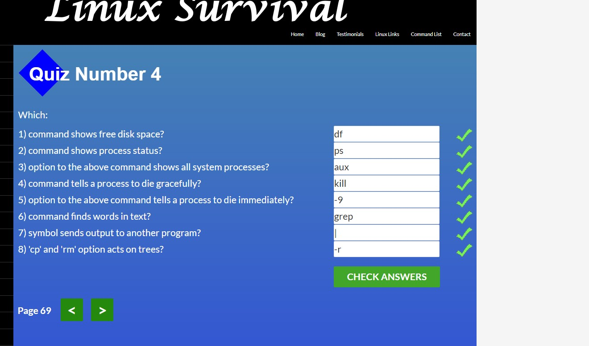
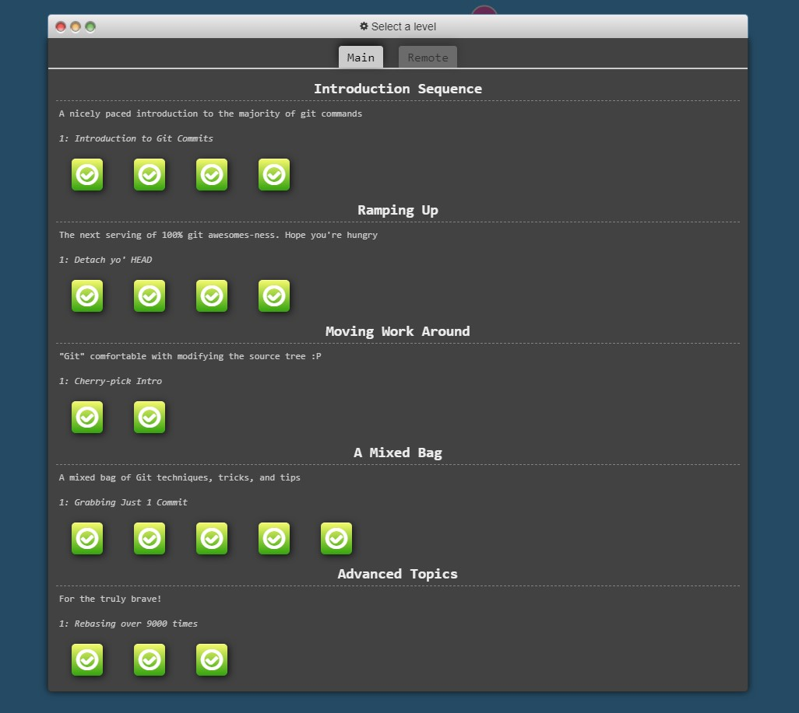
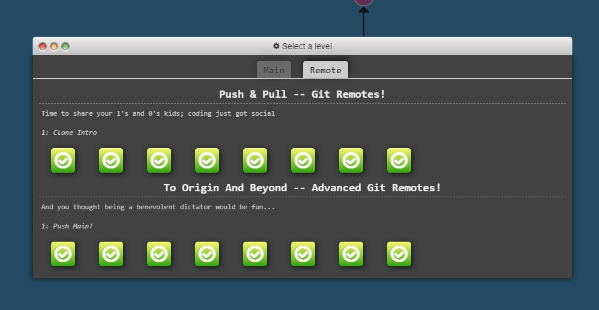
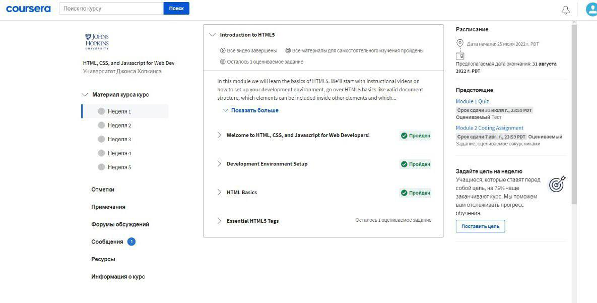
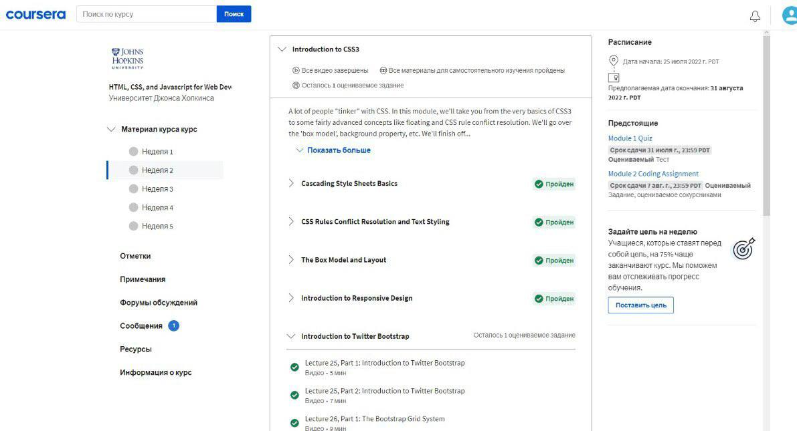

# kottans-frontend

# 0. Git-intro

It's all new to me and I'm really excited to learn new things, especially about Git, because I don't use it very often in my projects, and all this Git stuff has always been difficult for me, and I wanted to understand what is happening here from the very beginning.

# 1. Linux CLI, and HTTP

Everything in this lesson was relatively new to me.
I was surprised that the Linux OS is so powerful and at the same time easy to learn. The commands may seem complicated at first, but they are actually quite simple.
I don't use Linux in my daily life, but I'm sure I'll be using these commands that I've already learned in the Git Bash terminal.

# 2. Git Collaboration

Every single topic in this module was new to me. Especially branching, working with remote repositories (push & pull, conflict resolution and Pull Requests)
It was really amazing to me that working in Git Bash can be so easy and convenient.
Since I joined Kottans, I will definitely use these things for my learning path here: making commits, resolving problems and conflicts in the repository, working with a remote repo, using Git Bash more confidently in my work, and tracking the commit history.

# 3. Intro to HTML and CSS

This was nothing new to me because I had already learned HTML and CSS, but it was very helpful to revisit the basics.
I was pleasantly surprised that at any moment I can repeat the basics and not be afraid to forget something.
Since these are the basics, I can't deny the fact that I have to use it all from start to finish.

