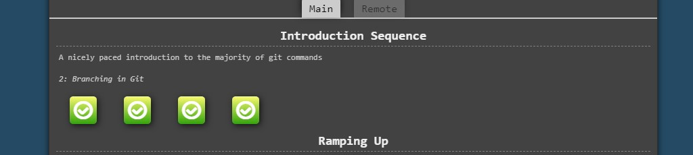

# kottans-frontend

# Git-intro

It's all new to me and I'm really excited to learn new things, especially about Git, because I don't use it very often in my projects, and all this Git stuff has always been difficult for me, and I wanted to understand what is happening here from the very beginning.

